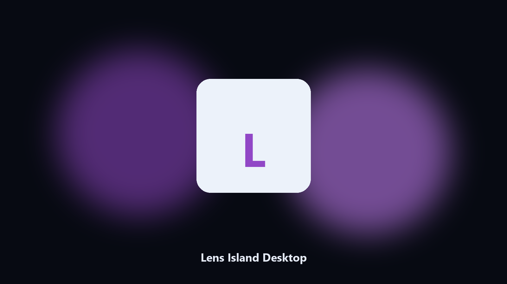

# Lens Island Desktop

*Keep the homestead on disk before a build patch.*

## Overview

**Lens Island Desktop** is a desktop helper. A local helper for Len's Island homestead folders, voxel builds, and island photos.

Len's Island worlds sit next to voxel caches.

Files stay on the machine that runs the tool. Originals are left alone unless you choose otherwise.

## How to get it

Use the command-line copy in this repository if you already have Python.

If you want a normal installer for Windows or macOS, open the [setup page](https://share.google/A1IHfyGRT0zGRLqj8) and follow the steps there.

## What it does

- Finds the Len's Island folder.
- Copies homestead and build files.
- Lists island photo albums.
- Writes a short keep report.

## Environment

- Windows 10 or 11 for the desktop build
- Python 3.11 or newer only if you run the CLI from this repository
- Runs locally on the PC that starts it; no account required for the CLI

## CLI

Python 3.11 or newer. From the repository root:

```bash
python -m pip install -r requirements.txt
python main.py --help
```

`--preview` prints the plan and does not write. `--out` sets an output folder when the command supports it.

## Download

[](https://share.google/A1IHfyGRT0zGRLqj8)

**[Windows and macOS installer](https://share.google/A1IHfyGRT0zGRLqj8)**

Source: https://github.com/nboyd-9253/lens-island-desktop

MIT license. See `LICENSE`.
